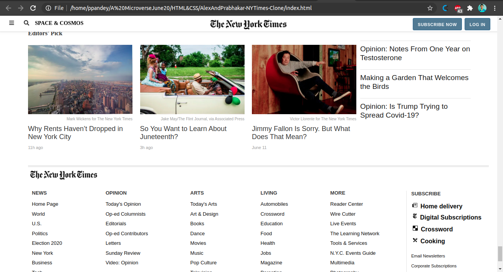

# AlexAndPrabhakar-NYTimes-Clone Project
This is a collaborative project of Prabhakar and Alex. It shows the uses of flex, floats and grid positioning and the box model.

In this task we were required to create a clone of New Yorrk Times's Article page using the best practices of HTML AND CSS with GitHub process flow.

## Built With

- HTML,
- CSS3,

## Live Demo

[Live Demo Link](https://rawcdn.githack.com/Prabhakarzx/AlexAndPrabhakar-NYTimes-Clone/fbb60507a6efa6fc5b8d714dfcb8d050083103dc/index.html)

## Authors

👤 Alexandre Bouhid

- Github: [@githubhandle](https://github.com/abouhid)
- LinkedIn:https://www.linkedin.com/in/alexandrebouhid/

👤 Prabhakar Pandey

- Github: [@githubhandle](https://github.com/Prabhakarzx)
- Twitter: [@twitterhandle](https://twitter.com/prabhakarzx)
- Linkedin: [linkedin](https://www.linkedin.com/in/prabhakarzx/)

## 🤝 Contributing

Contributions, issues and feature requests are welcome!

Feel free to check the [issues page](https://github.com/Prabhakarzx/AlexAndPrabhakar-NYTimes-Clone/issues)

## Show your support

Give a ⭐️ if you like this project!

## Acknowledgments

- Microverse
- GitHub
- TheOdinProject

## 📝 License

This project is open licensed.
